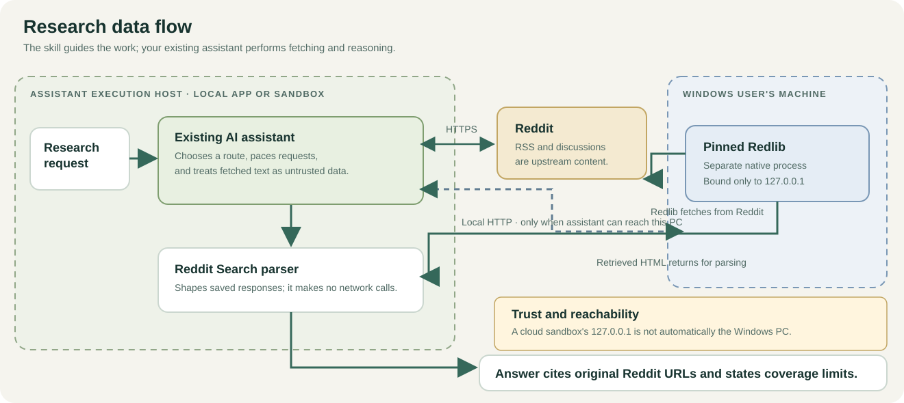
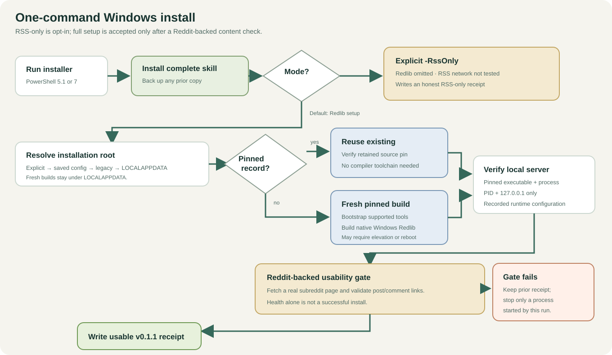

# Reddit Search + Redlib

**Research Reddit discussions with direct citations, usable comments, and clear coverage limits.**

[Project site](https://scottconverse.github.io/reddit-search-redlib/) · [User manual](USER-MANUAL.md) · [Releases](https://github.com/scottconverse/reddit-search-redlib/releases) · [Report an issue](https://github.com/scottconverse/reddit-search-redlib/issues)

**Version 0.1.2** · [Changelog](CHANGELOG.md)

Reddit Search + Redlib is an Agent Skill: research instructions, a small Python parser, and a native Windows installer for [Redlib](https://github.com/redlib-org/redlib). Your existing assistant performs the search and reasoning using its own network and execution tools. This project adds no model, hosted search service, subscription, or MCP server.

## What it does

- Finds candidate discussions through Reddit RSS and, when configured, Redlib search.
- Extracts post bodies and available comments from Redlib pages, including reply structure when present.
- Preserves source links, dates, scores, code indentation, text order, and table columns.
- Marks results complete, partial, or unknown based on the response evidence; missing content stays visible.
- Gives the assistant request-pacing and retry guidance. The parser itself does not make network requests.

RSS is an independent access path. The Windows installer sets up Redlib by default; `-RssOnly` explicitly omits it. Neither access path is guaranteed to work: Reddit and public instances can rate-limit or block requests.

## How research flows

The skill directs the assistant to fetch candidate pages, pass saved responses to the parser, and cite the original Reddit discussion. Reddit content is untrusted input. A local Redlib listener is bound to loopback and is useful only to an assistant running on a host that can reach that same machine.



The Windows installer backs up an existing skill, installs the full skill folder, and provisions or reuses the pinned Redlib source. It writes a usable Redlib receipt only after checking process ownership, loopback binding, and a Reddit-backed content response. RSS-only is a separate explicit outcome.



## Install

Download and extract the ZIP from [Releases](https://github.com/scottconverse/reddit-search-redlib/releases/latest). On Windows, run the complete installer from the extracted folder:

```powershell
powershell.exe -NoProfile -ExecutionPolicy Bypass -File .\reddit-search\scripts\install_windows.ps1
```

It installs or updates the skill, provisions or reuses native Redlib, starts or reuses the loopback service, and checks Reddit-backed content before reporting full success. Windows PowerShell 5.1 can launch the entrypoint; it relaunches under PowerShell 7. A fresh Redlib build bootstraps supported prerequisites and may require elevation or a reboot. The first build can take time. Reusing a valid pinned install does not require a compiler toolchain.

Use `-RssOnly` only when you want to omit Redlib. Its receipt confirms the skill and parser setup; it does not claim that RSS access was tested. The ZIP does not execute anything when extracted.

Fresh-build testing on native Windows 11 Pro took two runs. The first, elevated bootstrap installed the missing Visual Studio 2022 C++ Build Tools/SDK and LLVM and downloaded portable NASM; it built the pinned Redlib commit and passed the Reddit-backed gate, but exposed a caller hang from inherited process handles. The corrected second run used the PowerShell 5.1 entrypoint as a standard user, with the default Redlib root absent and a fresh Cargo cache and target. It reused the installed C++ toolchain and LLVM, used bundled CMake, and freshly downloaded NASM. PowerShell 7, Git, Python, and Rust were already present, so their missing-tool bootstrap paths were not tested. The build exited successfully in 284.8 seconds while Redlib remained alive and the captured caller output pipes closed. The Reddit-backed gate returned HTTP 200 with 25 posts and 54 comment links. This was not a pristine-VM test. See the [Windows setup and troubleshooting guide](USER-MANUAL.md#4-optional-local-redlib-on-windows).

Follow-up acceptance exercised listing (25 posts), search (1 post), RSS (21 posts), and a thread with 25 of 29 reported comments, correctly labeled partial. Redlib reuse, stop, restart, and a fresh content gate after restart passed; test instances were stopped afterward.

On other hosts, install the complete `reddit-search` skill folder using that app's supported skill directory. A bare folder copy is the installation method for non-Windows hosts; Windows users should use the full installer above.

| Host | Installation | Verification |
|---|---|---|
| Codex | Windows installer or supported skill directory | Live search and parsing verified on Windows |
| DeepSeek Harness | Scanned skill directory or configured filesystem provider | Skill discovery verified in DSH 0.1.5-rc.2; autonomous research not independently verified |
| Claude Code | `~/.claude/skills/reddit-search/` | Compatible skill format; live trial not completed |
| Claude Desktop / Cowork | Upload ZIP through the available Skills UI | Host network and local-machine access must be checked; localhost may refer to a sandbox |

A cloud-hosted assistant cannot reach a server on your PC just because you uploaded the skill. Check the execution environment before relying on local Redlib.

## What has been checked

One Windows live trial returned 22 RSS posts, 25 linked Redlib search results, and a thread with 23 of 23 reported comments. Another thread returned 35 of 44 reported comments and was correctly labeled partial. These observations are not uptime or completeness guarantees.

The regression suite uses synthetic fixtures for parser behavior and native Windows installer/lifecycle guards. CI does not fetch Reddit pages or build Redlib. A healthy local process alone is not evidence that Reddit-backed content is currently usable.

## Development checks

From a source checkout, run the tests and package builder with Python 3.10+. To regenerate the browser manual, also install PowerShell 7; its built-in Markdown renderer runs locally and does not contact GitHub.

```powershell
python -m unittest discover -s skills/reddit-search/scripts/tests -v
python tools/build_manual.py
python tools/build_package.py
```

The package builder verifies the canonical version, skill metadata, documentation, and required files. It emits ZIP and `.skill` archives with normalized LF text and matching contents. No Redlib executable or source is bundled.

## Privacy and limits

RSS can truncate content and does not establish the full reply tree. Redlib may omit comments, and its HTML can change. A successful health check does not prove Reddit access. The skill asks the assistant to report the evidence it could not retrieve rather than fill gaps from memory.

No Reddit login or API key is required for this workflow. A public Redlib operator can see requests sent to that instance. Prefer your own instance; do not send private information to public hosts or rotate through volunteer instances to evade blocks.

## Project files and licensing

- `skills/reddit-search/` — installable skill, parser, references, Windows scripts, and regression tests.
- `docs/` — landing page, generated browser manual, styles, and architecture diagrams.
- `USER-MANUAL.md` — setup, first search, Windows Redlib, troubleshooting, and removal.
- `tools/` — local manual rendering and reproducible package generation.
- `VERSION` and `CHANGELOG.md` — canonical project version and release history.

The skill and helper code are MIT licensed. Redlib is a separate upstream project under AGPL-3.0; its executable and source are downloaded during setup and are not included in this package. See [LICENSE](LICENSE) and [THIRD-PARTY-NOTICES.md](THIRD-PARTY-NOTICES.md).

Created by Scott Converse. Independent project; not affiliated with Reddit, Anthropic, OpenAI, or DeepSeek.
